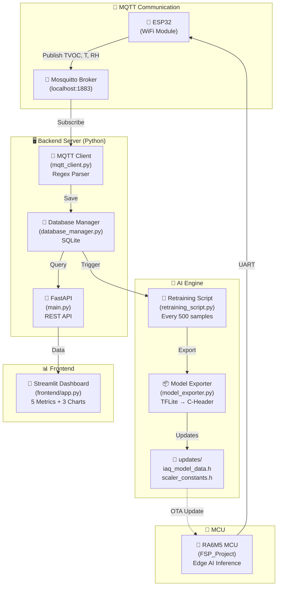
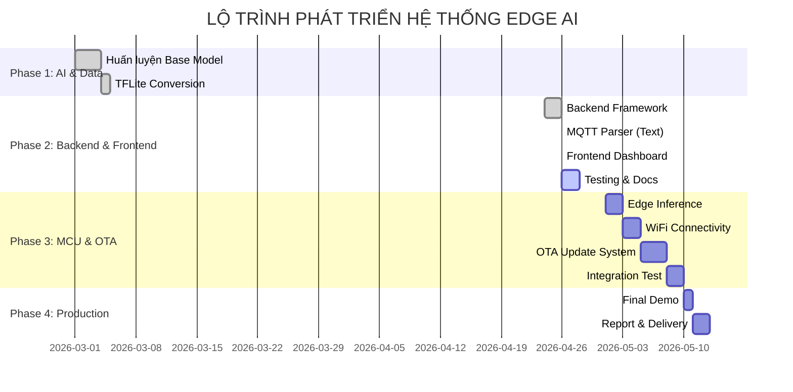

# 🍃 Edge AI IAQ Prediction System - CK-RA6M5

## 📌 Mô Tả Dự Án

Hệ thống **Edge AI** dự đoán **chỉ số IAQ (Indoor Air Quality)** theo chuẩn **UBA** (1.0-5.0) sử dụng:
- **Cảm biến**: ZMOD4410 (CO2, VOC)
- **Chip MCU**: CK-RA6M5 (Edge AI Inference)
- **Backend**: FastAPI + MQTT + SQLite
- **Frontend**: Streamlit Dashboard
- **MLOps**: Tự động học lại model từ dữ liệu thực tế

---

## ✨ Các Cập Nhật Mới Nhất (April 2026)

### 🔄 MQTT Data Processing Pipeline
- ✅ **Parser text-based** thay vì JSON
- ✅ **Extract fields**: TVOC, IAQ Actual, IAQ Predict, Temperature, Humidity
- ✅ **Regex patterns** để parse data từ ESP32 format

### 📊 Database Schema Enhanced
- ✅ **Thêm columns**: `temperature`, `humidity`
- ✅ **Auto migration** cho database cũ
- ✅ **Remove unused**: `eco2` column

### 📈 Frontend Dashboard Improved
- ✅ **5 metrics**: TVOC, IAQ Actual, MAE, Temperature, Humidity
- ✅ **3 biểu đồ**: IAQ Trend, TVOC Timeline, Environment Metrics
- ✅ **UBA Color zones** (Xanh→Đỏ)

### 🧪 Testing & Documentation
- ✅ **Unit tests**: `test_mqtt_pipeline.py`
- ✅ **Auto test commands**: `send_mqtt_test.ps1`
- ✅ **Complete guides**: MQTT_DATA_PROCESSING.md, TEST_GUIDE.md, QUICK_START.md

---

## 🔄 MQTT Data Processing Workflow

```
┌─────────────────────────────────────────────────────────────────┐
│                    ESP32 gửi dữ liệu MQTT                       │
│  [547034 ms] Published: TVOC=144.0ppb | Actual=1.86 | Predict=1.80
│  [548171 ms] [sensor:263] T=31.1 C  RH=46.9%                    │
└─────────────────────────────────────────────────────────────────┘
                              ↓
┌─────────────────────────────────────────────────────────────────┐
│         MQTT Client (backend/mqtt_client.py)                     │
│  • Subscribe: iaq/node/data                                      │
│  • Parse với Regex Patterns                                      │
│    - TVOC=(\d+\.?\d*)\s*ppb                                      │
│    - Actual=(\d+\.?\d*)                                          │
│    - T=(\d+\.?\d*)\s*C                                           │
│    - RH=(\d+\.?\d*)%                                             │
│  • Validate: đủ TVOC, Actual, Predict?                           │
│  • Cache: latest temperature/humidity                            │
└─────────────────────────────────────────────────────────────────┘
                              ↓ (Dữ liệu hợp lệ)
┌─────────────────────────────────────────────────────────────────┐
│     Database Manager (backend/database_manager.py)               │
│  • Save to SQLite: air_quality_logs                              │
│    - timestamp, tvoc, iaq_actual, iaq_forecast                   │
│    - temperature, humidity                                       │
│  • Auto migration (thêm columns nếu cần)                         │
│  • Count samples (check trigger retrain at 500)                  │
└─────────────────────────────────────────────────────────────────┘
                              ↓
┌─────────────────────────────────────────────────────────────────┐
│              Trigger Checks & Processing                         │
├─────────────────────┬─────────────────┬─────────────────────────┤
│  Check Retrain      │   API Handler   │  Frontend Update        │
│  (500 samples?)     │   /api/v1/      │  (Streamlit refresh)    │
│  ↓ YES              │   latest        │  ↓                      │
│  Start Retraining   │   history       │  Dashboard shows:       │
│  (async thread)     │                 │  • Metrics              │
│                     │                 │  • Charts & Trends      │
└─────────────────────┴─────────────────┴─────────────────────────┘
                              ↓
┌─────────────────────────────────────────────────────────────────┐
│      AI Engine Retraining (ai_engine/retraining_script.py)       │
│  (Triggered every 500 samples)                                   │
│  • Extract data from database                                    │
│  • Normalize: StandardScaler                                     │
│  • Fine-tune: Epochs=15, LR=0.0001                               │
│  • Export: TFLite + C-Header (updates/)                          │
│  • Ready for OTA update to MCU                                   │
└─────────────────────────────────────────────────────────────────┘
```

---

## 📁 Cấu Trúc Dự Án

```
Embedded-Project/
├── 🎯 Core Files
│   ├── backend/
│   │   ├── mqtt_client.py          ✨ UPDATED: Regex parser
│   │   ├── database_manager.py     ✨ UPDATED: New schema
│   │   ├── main.py                 FastAPI server
│   │   ├── hardware_simulate.py    MQTT data simulator
│   │   └── iaq_history.db          SQLite database
│   │
│   ├── frontend/
│   │   └── app.py                  ✨ UPDATED: 5 metrics + 3 charts
│   │
│   ├── ai_engine/
│   │   ├── retraining_script.py    Auto retraining
│   │   └── model_exporter.py       TFLite → C-Header
│   │
│   ├── updates/                    Model outputs
│   │   ├── IAQ_model.h5
│   │   ├── iaq_model.tflite
│   │   ├── iaq_model_data.h
│   │   └── scaler_constants.h
│   │
│   ├── API_call_model/             C++ model inference
│   │   ├── iaq_predictor.cpp
│   │   └── iaq_predictor.h
│   │
│   └── FSP_Project/                RA6M5 firmware
│       ├── src/
│       ├── ra_gen/
│       └── CMakeLists.txt
│
├── 📚 Documentation (NEW)
│   ├── QUICK_START.md              🚀 Bắt đầu nhanh 5 phút
│   ├── MQTT_DATA_PROCESSING.md     📡 Chi tiết quy trình
│   ├── TEST_GUIDE.md               🧪 Hướng dẫn test
│   ├── DETAILED_CHANGES.md         🔍 So sánh trước/sau
│   ├── CHANGES_SUMMARY.md          📝 Tóm tắt cập nhật
│   └── README.md                   📖 File này
│
└── 🧪 Test Files (NEW)
    ├── test_mqtt_pipeline.py       Unit tests
    ├── send_mqtt_test.ps1          Auto test (Windows)
    ├── test_mqtt_commands.ps1      Interactive test
    └── test_mqtt_commands.sh       Test commands (Linux)
```

---

## 🚀 Quick Start (5 Phút)

### ✅ Yêu Cầu
- Python 3.8+
- Mosquitto Broker
- Virtual environment activated

### 📋 Bước 1: Khởi Động Mosquitto (MQTT Broker)

**Terminal 1:**
```powershell
mosquitto -p 1883
```

**Output:**
```
1629829264: mosquitto version 2.0.14 starting
1629829264: Using default config from C:\Program Files\mosquitto\mosquitto.conf
1629829264: Opening ipv4 listen socket on port 1883
```

### 📋 Bước 2: Khởi Động Backend Server

**Terminal 2:**
```powershell
python -m backend.main
```

**Output:**
```
🚀 Khởi tạo Database...
📡 Đang khởi động MQTT Client Service...
✅ MQTT Connected to Broker
INFO:     Uvicorn running on http://0.0.0.0:8000
```

### 📋 Bước 3: Khởi Động Frontend Dashboard

**Terminal 3:**
```powershell
streamlit run frontend/app.py
```

**Output:**
```
Local URL: http://localhost:8501
```

Trình duyệt sẽ tự động mở. Bạn sẽ thấy dashboard trống (chờ dữ liệu).

### 📋 Bước 4: Gửi Test MQTT Messages

**Terminal 4:**
```powershell
.\send_mqtt_test.ps1
```

**Output Terminal 4:**
```
===== MQTT Test Messages =====
Test 1: Send TVOC + IAQ data
Sent: [547034 ms] Published: TVOC=144.0ppb | Actual=1.86 | Predict=1.80
Test 2: Send Temperature + Humidity
Sent: [548171 ms] [sensor:263] T=31.1 C  RH=46.9%
...
===== All tests sent! =====
```

**Output Terminal 2 (Backend):**
```
📨 Raw MQTT: [547034 ms] Published: TVOC=144.0ppb | Actual=1.86 | Predict=1.80
✅ Parsed: {'tvoc': 144.0, 'iaq_actual': 1.86, 'iaq_forecast': 1.80}
✅ Saved: TVOC=144.0ppb, Actual=1.86, Predict=1.80
```

**Terminal 3 (Dashboard):** Sẽ hiển thị metrics + charts 📊

---

## 📊 MQTT Data Format

### Input Format (từ ESP32)

```
[547034 ms] Published: TVOC=144.0ppb | Actual=1.86 | Predict=1.80
[548171 ms] [sensor:263] T=31.1 C  RH=46.9%
[552043 ms] [IAQ_Predict OK]
```

### Extract Fields

| Field | Regex Pattern | Example | Range |
|-------|---------------|---------|-------|
| **TVOC** | `TVOC=(\d+\.?\d*)\s*ppb` | 144.0 | 0-5000 ppb |
| **IAQ Actual** | `Actual=(\d+\.?\d*)` | 1.86 | 1.0-5.0 (UBA) |
| **IAQ Predict** | `Predict=(\d+\.?\d*)` | 1.80 | 1.0-5.0 (UBA) |
| **Temperature** | `T=(\d+\.?\d*)\s*C` | 31.1 | -40 to 85 °C |
| **Humidity** | `RH=(\d+\.?\d*)%` | 46.9 | 0-100 % |

### Database Schema

```sql
CREATE TABLE air_quality_logs (
    id INTEGER PRIMARY KEY AUTOINCREMENT,
    timestamp DATETIME,           -- "2024-04-26 10:30:45"
    tvoc REAL,                    -- 144.0 ppb
    iaq_actual REAL,              -- 1.86 (UBA)
    iaq_forecast REAL,            -- 1.80 (UBA)
    temperature REAL,             -- 31.1 °C (NEW)
    humidity REAL                 -- 46.9 % (NEW)
);
```

---

## 📈 System Architecture



---

## 🧪 Testing

### Run Unit Tests
```powershell
python test_mqtt_pipeline.py
```

**Output:**
```
✅ Pattern 'TVOC=(\d+\.?\d*)\s*ppb' matches 'TVOC=144.0ppb' = 144.0
✅ Valid payload contains all required fields: True
✅ ALL TESTS PASSED!
```

### Check Database
```powershell
sqlite3 backend/iaq_history.db
SELECT * FROM air_quality_logs ORDER BY id DESC LIMIT 5;
```

### API Endpoints
```powershell
# Latest record
curl http://localhost:8000/api/v1/latest

# History (100 records)
curl http://localhost:8000/api/v1/history?limit=100
```

---

## 🎯 IAQ UBA Rating Levels

| Level | Range | Color | Meaning |
|-------|-------|-------|---------|
| **1** | 1.0-1.9 | 🟢 Green | Very Good |
| **2** | 1.9-2.9 | 🟡 Yellow-Green | Good |
| **3** | 2.9-3.9 | 🟡 Yellow | Fair |
| **4** | 3.9-4.9 | 🟠 Orange | Poor |
| **5** | 4.9-5.0 | 🔴 Red | Very Poor |

---

## 📚 Documentation

| File | Purpose |
|------|---------|
| **QUICK_START.md** | 🚀 Bắt đầu nhanh 5 phút |
| **MQTT_DATA_PROCESSING.md** | 📡 Chi tiết quy trình MQTT |
| **TEST_GUIDE.md** | 🧪 Hướng dẫn test toàn bộ |
| **DETAILED_CHANGES.md** | 🔍 Chi tiết so sánh trước/sau |
| **CHANGES_SUMMARY.md** | 📝 Tóm tắt cập nhật |

---

## 🔧 Troubleshooting

| Issue | Solution |
|-------|----------|
| Connection refused | Chắc chắn Mosquitto đang chạy: `mosquitto -p 1883` |
| MQTT not parsing | Kiểm tra log Terminal 2, chạy tests: `python test_mqtt_pipeline.py` |
| Database locked | Xóa lock files: `rm backend/iaq_history.db-wal` |
| Port 8501 busy | Dùng port khác: `streamlit run frontend/app.py --server.port 8502` |
| Module not found | Cài packages: `pip install -r REQUIREMENT.txt` |

---

## 📊 Performance Metrics

| Metric | Value | Notes |
|--------|-------|-------|
| MQTT Parse Time | ~1ms | Regex patterns |
| Database Insert | ~5ms | SQLite |
| API Response | <100ms | Simple queries |
| Dashboard Refresh | 3s | Streamlit polling |
| Model Inference | ~50ms | TFLite on RA6M5 |
| Retrain Trigger | Every 500 samples | ~25 minutes |

---

## 📝 Development Timeline



---

## 👥 Team & License

- **Developed by**: IoT & Edge AI Lab
- **License**: MIT
- **Last Updated**: April 26, 2026

---

## 📞 Support & Contact

Nếu gặp vấn đề:
1. ✅ Kiểm tra file tài liệu tương ứng
2. ✅ Chạy unit tests để debug
3. ✅ Xem logs trong terminal
4. ✅ Tham khảo TEST_GUIDE.md

---

**Happy coding! 🚀**

    - Khối Dashboard: Hiển thị số liệu thực tế, kết quả dự báo và trạng thái cập nhật của mô hình AI.
```

Lưu đồ giải thuật tổng quát:


Lưu đồ task AI Inference (Edge AI)
Đây là trọng tâm xử lý của model AI trên notebook kaggle, nhằm huấn luyện mô hình AI.


Lưu đồ Task Cập nhật model (OTA)
Cập nhật model mới sau khi huấn luyện tăng cường trên Server thông qua WIFI.


Cấu trúc thư mục:

```
IAQ_EdgeAI_Dashboard/
├── backend/                # Xử lý dữ liệu và kết nối Kit
│   ├── main.py             # FastAPI App khởi tạo server
│   ├── mqtt_client.py      # Lắng nghe dữ liệu từ ESP32 gửi lên
│   ├── database_manager.py # Quản lý InfluxDB/SQLite lưu lịch sử cảm biến
│   └── api/                # Các endpoint trả về dữ liệu cho Dashboard
├── frontend/               # Giao diện người dùng
│   ├── app.py              # Streamlit dashboard hiển thị biểu đồ
│   └── components/         # Các widget (gauge, line chart)
├── ai_engine/              # "Lò luyện" AI trên Server
│   ├── retraining_script.py# Script lấy data từ DB để học tăng cường
│   ├── model_exporter.py   # Chuyển đổi .h5 sang .tflite và Header .h
│   └── vault/              # Nơi lưu trữ các version của model (v1, v2...)
├── updates/                # Thư mục chứa file binary để ESP32 tải về (OTA)
│   └── iaq_model_latest.bin
├── requirements.txt        # Các thư viện cần thiết (FastAPI, paho-mqtt, tensorflow)
└── docker-compose.yml      # (Tùy chọn) Chạy nhanh InfluxDB và Grafana
```