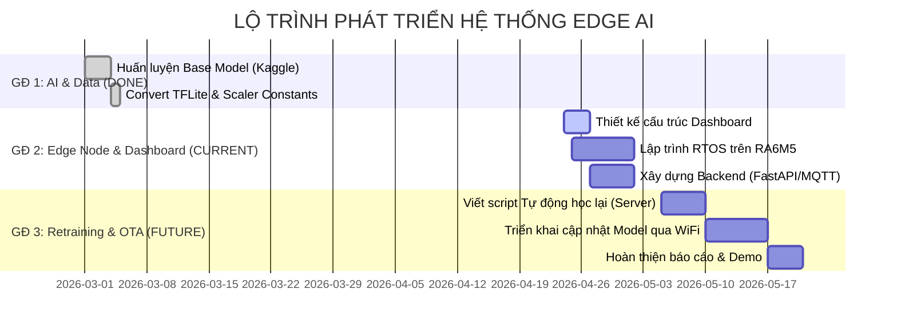
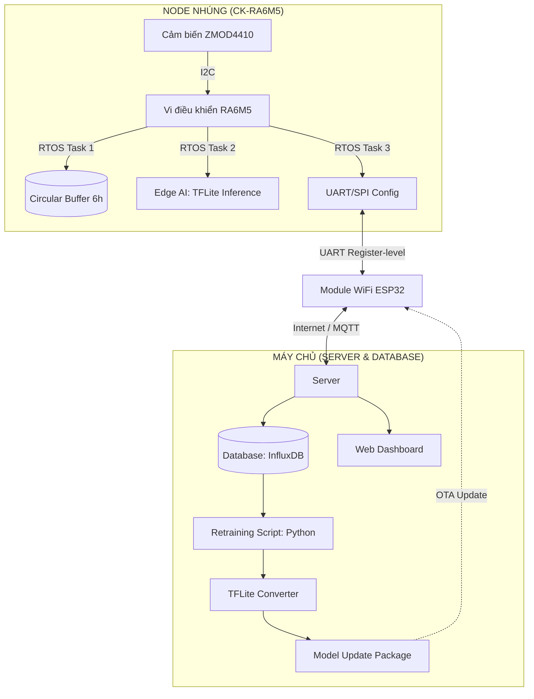
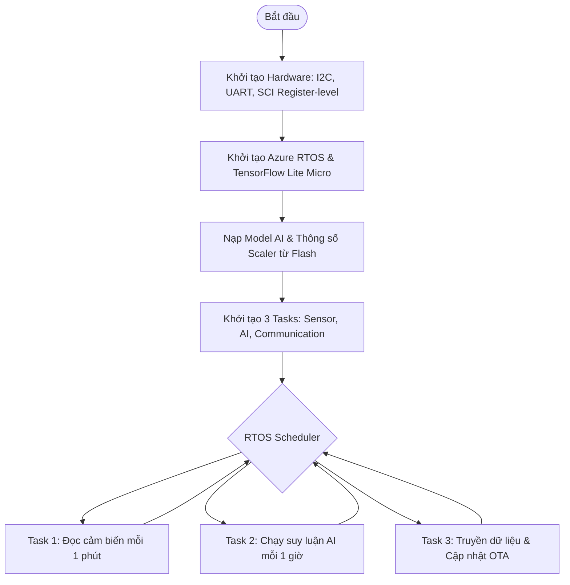
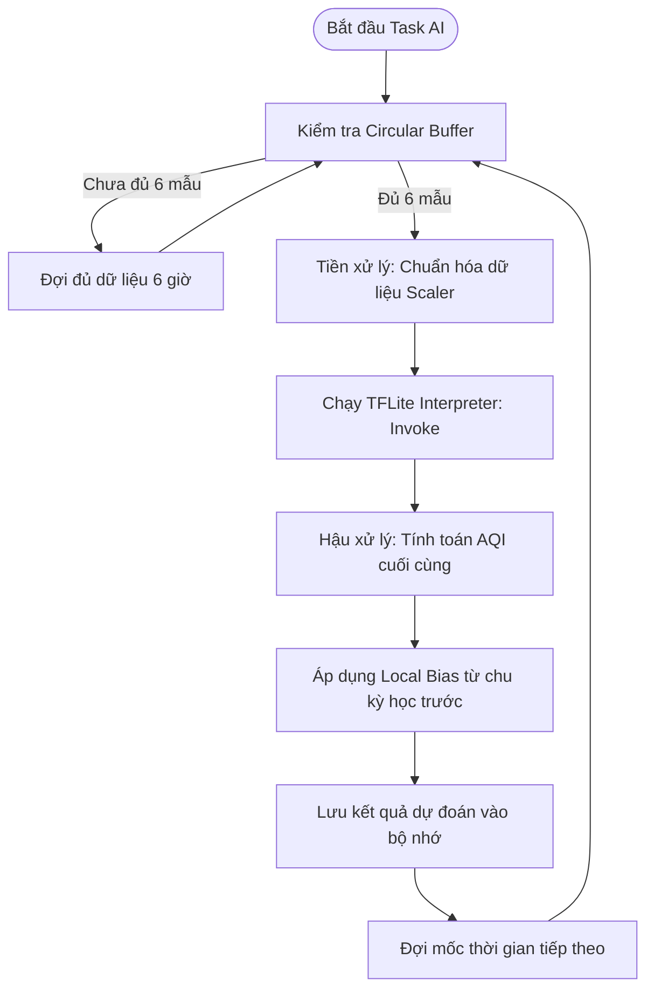
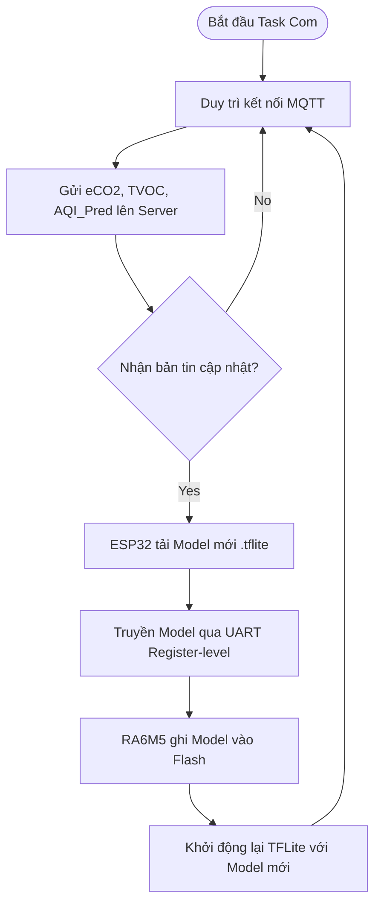

🌍 1️⃣ Lấy dữ liệu chất lượng không khí từ Open-Meteo

Open-Meteo có Air Quality API riêng, cho phép lấy:
```
    PM2.5

    PM10

    CO

    NO2

    O3

    SO2

    AQI (US AQI / EU AQI)
```

🔹 Ví dụ URL API
```
https://air-quality-api.open-meteo.com/v1/air-quality?
latitude=LAT&longitude=LON
&hourly=pm2_5,pm10,carbon_monoxide,nitrogen_dioxide,ozone,us_aqi
&start_date=2023-01-01
&end_date=2023-12-31
```

🐍 Code Python lấy dữ liệu

Ví dụ (TP.HCM):
```
import requests
import pandas as pd

url = (
    "https://air-quality-api.open-meteo.com/v1/air-quality?"
    "latitude=10.8231&longitude=106.6297"
    "&hourly=pm2_5,pm10,carbon_monoxide,nitrogen_dioxide,ozone,us_aqi"
    "&start_date=2023-01-01"
    "&end_date=2023-12-31"
)

response = requests.get(url)
data = response.json()

df = pd.DataFrame(data["hourly"])
df["time"] = pd.to_datetime(df["time"])

print(df.head())
```

📊 2️⃣ Cấu trúc dữ liệu cho model

Giả sử bạn muốn:

🎯 Mục tiêu:

Dự đoán AQI trong 3 giờ tới

    🧠 Input (X):

    PM2.5

    PM10

    CO

    NO2

    O3

    🎯 Output (y):

    AQI tương lai (shift 3 giờ)

🔹 Tạo target tương lai
```        
df["target_aqi"] = df["us_aqi"].shift(-3)
df = df.dropna()
```

⚙️ 3️⃣ Tiền xử lý dữ liệu
Chuẩn hóa (rất quan trọng nếu sau này deploy MCU)
```
from sklearn.preprocessing import StandardScaler
from sklearn.model_selection import train_test_split

features = ["pm2_5", "pm10", "carbon_monoxide",
            "nitrogen_dioxide", "ozone"]

X = df[features].values
y = df["target_aqi"].values

scaler = StandardScaler()
X_scaled = scaler.fit_transform(X)

X_train, X_test, y_train, y_test = train_test_split(
    X_scaled, y, test_size=0.2, shuffle=False
)
```
⚠ Với time series → nên shuffle=False

🤖 4️⃣ Xây dựng Model
🔹 Cách 1: Model đơn giản (phù hợp MCU)
```
import tensorflow as tf

model = tf.keras.Sequential([
    tf.keras.layers.Dense(16, activation='relu', input_shape=(5,)),
    tf.keras.layers.Dense(8, activation='relu'),
    tf.keras.layers.Dense(1)
])

model.compile(
    optimizer='adam',
    loss='mse',
    metrics=['mae']
)

model.fit(X_train, y_train, epochs=30, batch_size=32)
```
✔ Nhẹ
✔ Dễ convert TFLite
✔ Phù hợp RA6M5

🔹 Cách 2: Model Time-Series nâng cao (LSTM)

Nếu muốn chính xác hơn:
```
model = tf.keras.Sequential([
    tf.keras.layers.LSTM(32, input_shape=(window_size, 5)),
    tf.keras.layers.Dense(1)
])
```
⚠ Nhưng LSTM tốn RAM hơn khi deploy MCU.

📈 5️⃣ Đánh giá model
```
loss, mae = model.evaluate(X_test, y_test)
print("MAE:", mae)
```
MAE < 5 → rất tốt
MAE 5–15 → chấp nhận được


```
Giải thích các khối chức năng trong sơ đồ
    - Khối Cảm biến (ZMOD4410): Thu thập các chỉ số hóa học eCO2 và TVOC từ môi trường thực tế.

    - Khối Vi điều khiển (RA6M5): Đóng vai trò trung tâm xử lý, sử dụng Azure RTOS để quản lý đa nhiệm.

    - Circular Buffer: Lưu trữ 6 mẫu dữ liệu gần nhất (tương đương 6 giờ) để làm đầu vào cho mô hình AI.

Edge AI: Thực hiện chuẩn hóa dữ liệu bằng bộ hằng số Mean/Scale và chạy suy luận AQI từ mô hình MLP.
    - Khối Module WiFi (ESP32): Là cầu nối giao tiếp, gửi dữ liệu cảm biến lên Server và nhận gói tin cập nhật mô hình mới.

    - Khối Retraining Script: Chạy trên Server để huấn luyện lại mô hình dựa trên dữ liệu thực tế từ Database, giúp cải thiện sai số MAE từ mức ban đầu 15.06.

    - Khối Dashboard: Hiển thị số liệu thực tế, kết quả dự báo và trạng thái cập nhật của mô hình AI.
```

Lưu đồ giải thuật tổng quát:


Lưu đồ task AI Inference (Edge AI)
Đây là trọng tâm xử lý của model AI trên notebook kaggle, nhằm huấn luyện mô hình AI.



Lưu đồ Task Cập nhật model (OTA)
Cập nhật model mới sau khi huấn luyện tăng cường trên Server thông qua WIFI.




Cấu trúc thư mục:

```
IAQ_EdgeAI_Dashboard/
├── backend/                # Xử lý dữ liệu và kết nối Kit
│   ├── main.py             # FastAPI App khởi tạo server
│   ├── mqtt_client.py      # Lắng nghe dữ liệu từ ESP32 gửi lên
│   ├── database_manager.py # Quản lý InfluxDB/SQLite lưu lịch sử cảm biến
│   └── api/                # Các endpoint trả về dữ liệu cho Dashboard
├── frontend/               # Giao diện người dùng
│   ├── app.py              # Streamlit dashboard hiển thị biểu đồ
│   └── components/         # Các widget (gauge, line chart)
├── ai_engine/              # "Lò luyện" AI trên Server
│   ├── retraining_script.py# Script lấy data từ DB để học tăng cường
│   ├── model_exporter.py   # Chuyển đổi .h5 sang .tflite và Header .h
│   └── vault/              # Nơi lưu trữ các version của model (v1, v2...)
├── updates/                # Thư mục chứa file binary để ESP32 tải về (OTA)
│   └── aqi_model_latest.bin
├── requirements.txt        # Các thư viện cần thiết (FastAPI, paho-mqtt, tensorflow)
└── docker-compose.yml      # (Tùy chọn) Chạy nhanh InfluxDB và Grafana
```